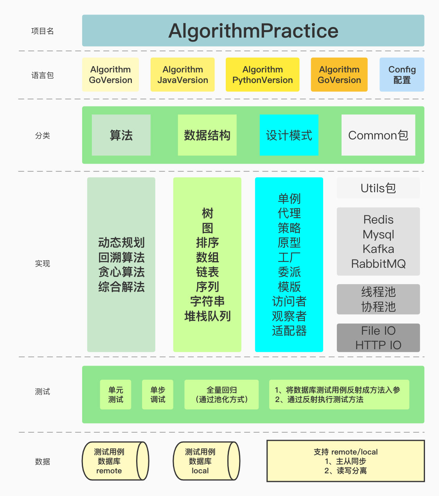
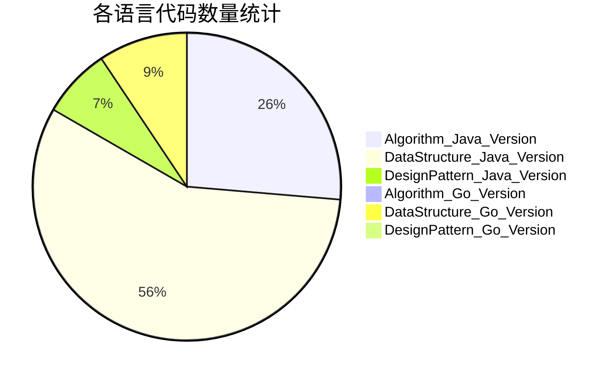

 <h1> 算法和数据结构的Java/Go实践  </h1>  

## �项目介绍
+ 本项目通过收集、分解各大厂的常见笔面试题，追本溯源至数据结构和算法的底层实现原理，采用Java和Go语言实现，配套测试数据和案例让代码更加准确。
+ 算法项目开源地址:[AlgoHub](https://gitee.com/micromicrohard/algo-hub) (欢迎练手的同学提 issue 和 PR 以及 Star)。
+ 本项目主要包括四个部分，分别是：算法、数据结构、设计模式、以及上述三个部分的单元测试，项目简图如图1-1所示：

 图 1-1 AlgorithmPractice项目结构简图  

### �️阅读建议
+ 本项目所有的测试案例已经迁移至腾讯云，需要从额外的conf配置文件中获取连接信息，否则无法全量测试，可以私聊获取PR的方式获取conf文件
+ 阅读顺序
  + 首先，你可以通过我的 [思维导图](https://www.processon.com/mindmap/5cbb5fcae4b09b16ffc06360),对项目整体架构有个了解,
  + 然后，可以跳转到我的 [博客](https://blog.csdn.net/Micro_Micro_Hard/article/details/104446607) 查看设计思路和实现细节,
  + 最后，通过跳转至我的 [gitee](https://gitee.com/micromicrohard/algo-hub) 查看具体的实现代码.

## 代码统计

### �[Java语言入口](https://gitee.com/micromicrohard/algo-hub/tree/master/AlgorithmJavaVersion)

| JavaVersion |  Total  | Algorithm  | DataStructure  | DesignPattern |
| --------    | :-----: |  :----:    |  :-----:       |    :-----:    |
| Code/UT     |  328/ 243   |       95/       71   |       197/      162      |        36/      10 |
| CodeNum/TestNum | 20499/ 14299 |     5858/     4125  |    13677/     9821  |      964/     353 |

### �[go语言入口](https://gitee.com/micromicrohard/algo-hub/tree/master/AlgorithmGoVersion)

| GoVersion |  Total  | Algorithm  | DataStructure  | DesignPattern |
| --------    | :-----: |  :----:    |  :-----:       |    :-----:    |
| Code/UT     |  34/ 32   |        2/        3   |        31/       28      |         1/       1 |
| CodeNum/TestNum | 1439/ 657 |       64/       57  |     1374/      599  |        1/       1 |

## �特色合集
+ 特色合集的代码接口在：[Topic](https://gitee.com/micromicrohard/algo-hub/tree/master/AlgorithmJavaVersion/src/Topic)
+ 动态规划
  + [常见动态规划的解题思路及Java实现](https://blog.csdn.net/Micro_Micro_Hard/article/details/103082359)
  + [零钱交换及其延伸问题的讨论](https://blog.csdn.net/Micro_Micro_Hard/article/details/122782616)
+ 设计模式
  + [11种常见设计模式的简单Demo实现](https://blog.csdn.net/Micro_Micro_Hard/article/details/105470727)
+ 字符串
  + [最长递增子序列的六种解法](https://blog.csdn.net/Micro_Micro_Hard/article/details/106596812)
  + [最热笔试题：利用滑动窗口来解决字符串匹配](https://blog.csdn.net/Micro_Micro_Hard/article/details/106972100)
  + [13道字符串笔试题及答案，总有一道你面试会遇上](https://blog.csdn.net/Micro_Micro_Hard/article/details/106975010)
+ 数据结构基础：
  + [堆栈队列](https://blog.csdn.net/Micro_Micro_Hard/article/details/111464502)
  + [二叉树](https://blog.csdn.net/Micro_Micro_Hard/article/details/109466318)
  + [链表](https://blog.csdn.net/Micro_Micro_Hard/article/details/109508557)
  + [内部排序](https://blog.csdn.net/Micro_Micro_Hard/article/details/102762758)
  + [跳表，红黑树，b+树，hashmap的区别](https://blog.csdn.net/Micro_Micro_Hard/article/details/112506408)

## �具体的项目目录结构

### �$\color{7f1A8A}Algorithm/算法专题$
 ****
+ **回溯专题**
  + [字符串全排列](https://gitee.com/micromicrohard/algo-hub/tree/master/AlgorithmJavaVersion/src/Algorithm/backtrack/StringCombination.java) 和 [测试案例](https://gitee.com/micromicrohard/algo-hub/tree/master/AlgorithmJavaVersion/src/UnitTest/AlgorithmTest/backtrackTest/StringCombinationTest.java) 
  + [组合数](https://gitee.com/micromicrohard/algo-hub/tree/master/AlgorithmJavaVersion/src/Algorithm/backtrack/CombinationNum.java) 和 [测试案例](https://gitee.com/micromicrohard/algo-hub/tree/master/AlgorithmJavaVersion/src/UnitTest/AlgorithmTest/backtrackTest/CombinationNumTest.java) 
  + [数组的连续积小于给定值的组合](https://gitee.com/micromicrohard/algo-hub/tree/master/AlgorithmJavaVersion/src/Algorithm/backtrack/ArrayPermutation.java) 和 [测试案例](https://gitee.com/micromicrohard/algo-hub/tree/master/AlgorithmJavaVersion/src/UnitTest/AlgorithmTest/backtrackTest/ArrayPermutationTest.java) 
+ **综合解法题**
  + **背包问题 (backpack)**
    + [动态规划、分支限界法(回溯法、剪枝法)、贪心算法](https://blog.csdn.net/Micro_Micro_Hard/article/details/109376733) 
    + [背包问题解决公司零食采购（贪心+冒泡+动态）](https://blog.csdn.net/Micro_Micro_Hard/article/details/107498635)  和 [测试案例](https://gitee.com/micromicrohard/algo-hub/tree/master/AlgorithmJavaVersion/src/UnitTest/AlgorithmTest/combineTest/backpackTest/implyTest)
  + **最长递增子序列 (LIS)**
    + [暴力法、动态规划法、分治法、字符串对比法、分支限界法、扑克法](https://blog.csdn.net/Micro_Micro_Hard/article/details/106596812) 和 [测试案例](https://gitee.com/micromicrohard/algo-hub/tree/master/AlgorithmJavaVersion/src/UnitTest/AlgorithmTest/combineTest/lisTest)
   + **最佳调度问题 (optimalSchedule)**
     + [分支限界、动态、贪心](https://gitee.com/micromicrohard/algo-hub/tree/master/AlgorithmJavaVersion/src/Algorithm/comprehensive/optimalSchedule) 和 [测试案例](https://gitee.com/micromicrohard/algo-hub/tree/master/AlgorithmJavaVersion/src/UnitTest/AlgorithmTest/combineTest/optimalScheduleTest)
  + **最短路径 (shortestDeliveryPath)**
    + [回溯法、贪心算法](https://gitee.com/micromicrohard/algo-hub/tree/master/AlgorithmJavaVersion/src/Algorithm/comprehensive/shortestDeliveryPath) 和 [测试案例](https://gitee.com/micromicrohard/algo-hub/tree/master/AlgorithmJavaVersion/src/UnitTest/AlgorithmTest/combineTest/shortestDeliveryPathTest)
  + **子段和/积问题 (sumofSubSequence)** 
    + 最大间隔乘积
      + **合唱团问题** [动态规划、回溯法](https://gitee.com/micromicrohard/algo-hub/tree/master/AlgorithmJavaVersion/src/Algorithm/comprehensive/choir) 和 [测试案例](https://gitee.com/micromicrohard/algo-hub/tree/master/AlgorithmJavaVersion/src/UnitTest/AlgorithmTest/combineTest/choirTest)
      + [打家劫舍2](https://gitee.com/micromicrohard/algo-hub/blob/master/AlgorithmJavaVersion/src/Algorithm/comprehensive/sumofSubSequence/LMG/ThiefSteal2.java) 
    + [最大子段乘积(连续) ](https://gitee.com/micromicrohard/algo-hub/blob/master/AlgorithmJavaVersion/src/Algorithm/comprehensive/sumofSubSequence/LMS/LargestMultiofSubSequence.java)
    + [最大间隔和：打家劫舍](https://gitee.com/micromicrohard/algo-hub/blob/master/AlgorithmJavaVersion/src/Algorithm/comprehensive/sumofSubSequence/LSG/ThiefSteal.java)
    + [最大子段和(连续)](https://gitee.com/micromicrohard/algo-hub/tree/master/AlgorithmJavaVersion/src/Algorithm/comprehensive/sumofSubSequence/LSS)
    + [数字的最大乘积(剪绳子问题)](https://gitee.com/micromicrohard/algo-hub/blob/master/AlgorithmJavaVersion/src/Algorithm/comprehensive/sumofSubSequence/NumReduceMaxMulti.java)

+ **动态规划专题**
  + **最大正方形**
    + [暴力法、动态规划、动态规划优化](https://gitee.com/micromicrohard/algo-hub/tree/master/AlgorithmJavaVersion/src/Algorithm/dynamic/largestSquare) 和 [测试案例](https://gitee.com/micromicrohard/algo-hub/tree/master/AlgorithmJavaVersion/src/UnitTest/AlgorithmTest/dynamicTest/largestSquareTest)
  + **最长公共子序列**
    + [动态规划、动态规划优化](https://gitee.com/micromicrohard/algo-hub/blob/master/AlgorithmJavaVersion/src/Algorithm/dynamic/lcs/)  和 [测试案例](https://gitee.com/micromicrohard/algo-hub/tree/master/AlgorithmJavaVersion/src/UnitTest/AlgorithmTest/dynamicTest/LCSTest.java)
  + **最大子段和**
    + [动态规划、分治法](https://gitee.com/micromicrohard/algo-hub/tree/master/AlgorithmJavaVersion/src/Algorithm/dynamic/lss)  和 [测试案例](https://gitee.com/micromicrohard/algo-hub/tree/master/AlgorithmJavaVersion/src/UnitTest/AlgorithmTest/dynamicTest/LSSTest.java)
  + **回文串**
    + [添加构造回文串、删除构造回文串、回文串判定、回文串判定优化](https://gitee.com/micromicrohard/algo-hub/tree/master/AlgorithmJavaVersion/src/Algorithm/dynamic/palindrome)  和 [测试案例](https://gitee.com/micromicrohard/algo-hub/tree/master/AlgorithmJavaVersion/src/UnitTest/AlgorithmTest/dynamicTest/PalindromeTest)
  + **其他**
    + [交换零钱、斐不拉楔数列、矩形的最小路径和、三角形的最小路径和、打家劫舍](https://gitee.com/micromicrohard/algo-hub/tree/master/AlgorithmJavaVersion/src/Algorithm/dynamic) 和 [测试案例](https://gitee.com/micromicrohard/algo-hub/tree/master/AlgorithmJavaVersion/src/UnitTest/AlgorithmTest/dynamicTest)
    + [编辑距离、数字的最大乘积、字符组成判断](https://gitee.com/micromicrohard/algo-hub/tree/master/AlgorithmJavaVersion/src/Algorithm/dynamic) 和 [测试案例](https://gitee.com/micromicrohard/algo-hub/tree/master/AlgorithmJavaVersion/src/UnitTest/AlgorithmTest/dynamicTest)
+ **贪心专题**
  + [无重叠区间](https://gitee.com/micromicrohard/algo-hub/tree/master/AlgorithmJavaVersion/src/Algorithm/greedy/EraseOverlapIntervals.java) 和 [测试案例](https://gitee.com/micromicrohard/algo-hub/tree/master/AlgorithmJavaVersion/src/UnitTest/AlgorithmTest/greedyTest/EraseOverlapIntervalsTest.java)
  + 迪杰斯特拉算法
+ **数学专题**
  + [大整数乘法、计算bit位、吸血鬼数字、水仙花数、平方根](https://gitee.com/micromicrohard/algo-hub/tree/master/AlgorithmJavaVersion/src/Algorithm/math) 和 [测试案例](https://gitee.com/micromicrohard/algo-hub/tree/master/AlgorithmJavaVersion/src/UnitTest/AlgorithmTest/mathTest)

### �$\color{7f1A8A}DataStructure /数据结构专题$
 **** 
+ **数组和链表**
  + **数组应用**
    + [前缀和/差分数组、盛水问题、字符扩展、细菌扩展、数独、大小写互换](https://gitee.com/micromicrohard/algo-hub/tree/master/AlgorithmJavaVersion/src/DataStructure/arrayANDlist/arrayApply) 和 [测试案例](https://gitee.com/micromicrohard/algo-hub/tree/master/AlgorithmJavaVersion/src/UnitTest/DatastructureTest/arrayANDlistTest/arrayApplyTest)
  + **数组操作**
    + [根据身高重建队列、查找给定值的数组区间、寻找极值、左小右大的数、矩阵相乘、贪吃蛇、买卖股票的最佳时机、杨辉三角](https://gitee.com/micromicrohard/algo-hub/tree/master/AlgorithmJavaVersion/src/DataStructure/arrayANDlist/arrayOps) 和 [测试案例](https://gitee.com/micromicrohard/algo-hub/tree/master/AlgorithmJavaVersion/src/UnitTest/DatastructureTest/arrayANDlistTest/arrayOpsTest)
  + **数组变换**
    + [顺时针打印螺旋矩阵、旋转数组的最小值、奇数左边偶数右边、反转字符串](https://gitee.com/micromicrohard/algo-hub/tree/master/AlgorithmJavaVersion/src/DataStructure/arrayANDlist/arrayTransformation) 和 [测试案例](https://gitee.com/micromicrohard/algo-hub/tree/master/AlgorithmJavaVersion/src/UnitTest/DatastructureTest/arrayANDlistTest/arrayTransformationTest)
  + **双指针问题**
    + [两数之和、三数之和、找出重复数组中不重复的个数、去除指定元素](https://gitee.com/micromicrohard/algo-hub/tree/master/AlgorithmJavaVersion/src/DataStructure/arrayANDlist/doublePoint) 和 [测试案例](https://gitee.com/micromicrohard/algo-hub/tree/master/AlgorithmJavaVersion/src/UnitTest/DatastructureTest/arrayANDlistTest/doublePointTest)
  + **查找值**
    + [返回数组的最值、矩阵中找值](https://gitee.com/micromicrohard/algo-hub/tree/master/AlgorithmJavaVersion/src/DataStructure/arrayANDlist/findValue) 和 [测试案例](https://gitee.com/micromicrohard/algo-hub/tree/master/AlgorithmJavaVersion/src/UnitTest/DatastructureTest/arrayANDlistTest/xorTest)
  + **哈希专题**
    + [LFU和LRU](https://gitee.com/micromicrohard/algo-hub/tree/master/AlgorithmJavaVersion/src/DataStructure/arrayANDlist/hashTable) 和 [测试案例](https://gitee.com/micromicrohard/algo-hub/tree/master/AlgorithmJavaVersion/src/UnitTest/DatastructureTest/arrayANDlistTest/hashTableTest)
  + **链表**
    + [单链表的插入、删除、查找、相等](https://gitee.com/micromicrohard/algo-hub/tree/master/AlgorithmJavaVersion/src/DataStructure/arrayANDlist/list/listRealize/SinglyLinkedList.java) 和 [测试案例](https://gitee.com/micromicrohard/algo-hub/tree/master/AlgorithmJavaVersion/src/UnitTest/DatastructureTest/arrayANDlistTest/listTest/SinglyLinkedListTest.java)
    + [链表的反转有多少种方式](https://blog.csdn.net/Micro_Micro_Hard/article/details/109508557)
    + [有环链表和相交链表、环入口判读](https://gitee.com/micromicrohard/algo-hub/tree/master/AlgorithmJavaVersion/src/DataStructure/arrayANDlist/list/listRealize/RingList.java)  和 [测试案例](https://gitee.com/micromicrohard/algo-hub/tree/master/AlgorithmJavaVersion/src/UnitTest/DatastructureTest/arrayANDlistTest/listTest/RingListTest.java)
    + [双向链表的插入、删除、查找、相等](https://gitee.com/micromicrohard/algo-hub/tree/master/AlgorithmJavaVersion/src/DataStructure/arrayANDlist/list/listRealize/DoubleLinkedList.java) 和 [测试案例](https://gitee.com/micromicrohard/algo-hub/tree/master/AlgorithmJavaVersion/src/UnitTest/DatastructureTest/arrayANDlistTest/listTest/DoubleLinkedListTest.java)  
    + [Redis底层数据结构：跳表的实现](https://blog.csdn.net/Micro_Micro_Hard/article/details/104504763)  
    + [链表的倒数第K个元素](https://gitee.com/micromicrohard/algo-hub/tree/master/AlgorithmJavaVersion/src/DataStructure/arrayANDlist/list/listRealize/TheLastK.java) 和 [测试案例](https://gitee.com/micromicrohard/algo-hub/tree/master/AlgorithmJavaVersion/src/UnitTest/DatastructureTest/arrayANDlistTest/listTest/TheLastKTest.java)  
  + **异或操作**
    + [异或问题](https://blog.csdn.net/Micro_Micro_Hard/article/details/108328921) 
+ **图专题**
  + **图的应用**
    + [CMG]()
  + **图连接**
    + [并查集及优化]()
  + **最小生成树**
    + [克鲁斯卡尔算法]()
    + [普瑞姆算法]()
  + **单源最短路径**
    + [狄杰斯特拉算法]()
  + **多源最短路径**
    + [弗洛伊德]()
    + [贝尔曼福德]()
+ **字符串和序列**      
    + **滑动窗口**
      + [找所有字母异位词、最长无重复子串、最小覆盖子串、最小覆盖字串1、子串检测、字符串预处理法、序列匹配](https://gitee.com/micromicrohard/algo-hub/tree/master/AlgorithmJavaVersion/src/DataStructure/stringANDline/slidingWindow) 和 [测试案例](https://gitee.com/micromicrohard/algo-hub/tree/master/AlgorithmJavaVersion/src/UnitTest/DatastructureTest/stringANDlineTest/slidingWindowTest)
    + **序列和字符串**
      + [人民币大小写转换、最小循环的字符串、IP地址转化](https://gitee.com/micromicrohard/algo-hub/tree/master/AlgorithmJavaVersion/src/DataStructure/stringANDline/sequenceANDstring) 和 [测试案例](https://gitee.com/micromicrohard/algo-hub/tree/master/AlgorithmJavaVersion/src/UnitTest/DatastructureTest/stringANDlineTest/sequenceANDstringTest)
    + **字符串匹配专题**
      + [五大经典字符串匹配算法的Java代码实现](https://blog.csdn.net/Micro_Micro_Hard/article/details/104448266)（BF、BM、RK、KMP、Sunday）
+ **排序专题**
    + 外部排序
    + 内部排序
      + [十大经典内部排序算法的设计思路及应用](https://blog.csdn.net/Micro_Micro_Hard/article/details/102762758)
        + 冒泡、堆排、插入、选择、桶排
        + 计数、归并、基数、希尔、快排及其改进
      + [链表的插入排序、指定区间的插入排序](https://gitee.com/micromicrohard/algo-hub/blob/master/AlgorithmJavaVersion/src/DataStructure/sort/innerSort/innerSortRealize/InsertSort.java) 和 [测试案例](https://gitee.com/micromicrohard/algo-hub/blob/master/AlgorithmJavaVersion/src/UnitTest/DatastructureTest/sortTest/innerSortTest/innerSortRealizeTest/InsertSortTest.java)

+ **堆栈队列**
    + [返回最小的第K个值、返回最小的K个值、找出第k大的素数、优先队列](https://gitee.com/micromicrohard/algo-hub/tree/master/AlgorithmJavaVersion/src/DataStructure/stackHeapQueue/heap)  和 [测试案例](https://gitee.com/micromicrohard/algo-hub/tree/master/AlgorithmJavaVersion/src/UnitTest/DatastructureTest/stackHeapQueueTest/heapTest)
    + [链队、数组队、用栈实现队](https://gitee.com/micromicrohard/algo-hub/tree/master/AlgorithmJavaVersion/src/DataStructure/stackHeapQueue/queue)  和 [测试案例](https://gitee.com/micromicrohard/algo-hub/tree/master/AlgorithmJavaVersion/src/UnitTest/DatastructureTest/stackHeapQueueTest/queueTest)
    + [链栈、数组栈、最小栈、最小栈优化、计算器的实现、括号匹配问题、队列实现栈](https://gitee.com/micromicrohard/algo-hub/tree/master/AlgorithmJavaVersion/src/DataStructure/stackHeapQueue/stack)  和 [测试案例](https://gitee.com/micromicrohard/algo-hub/tree/master/AlgorithmJavaVersion/src/UnitTest/DatastructureTest/stackHeapQueueTest/stackTest)

+ **树**
    + **二叉树**
      + [二叉树的序列化和反序列化](https://blog.csdn.net/Micro_Micro_Hard/article/details/109466318)
      + [最近公共祖先、二叉树中和为某值的节点路径、二叉树中最大子树路径和](https://gitee.com/micromicrohard/algo-hub/tree/master/AlgorithmJavaVersion/src/DataStructure/tree/binaryTree/binaryTreeApply)  和 [测试案例](https://gitee.com/micromicrohard/algo-hub/tree/master/AlgorithmJavaVersion/src/UnitTest/DatastructureTest/treeTest/binaryTreeTest/binaryTreeApplyTest)
      + [镜像二叉树(递归和非递归)、平衡二叉树判断、判断镜像二叉树、二叉树子树判读、打印树的左视图](https://gitee.com/micromicrohard/algo-hub/tree/master/AlgorithmJavaVersion/src/DataStructure/tree/binaryTree/binaryTreeApply)  和 [测试案例](https://gitee.com/micromicrohard/algo-hub/tree/master/AlgorithmJavaVersion/src/UnitTest/DatastructureTest/treeTest/binaryTreeTest/binaryTreeApplyTest)
    + [b树]()
    + [赫夫曼树](https://gitee.com/micromicrohard/algo-hub/tree/master/AlgorithmJavaVersion/src/DataStructure/tree/huffman)  和 [测试案例](https://gitee.com/micromicrohard/algo-hub/tree/master/AlgorithmJavaVersion/src/UnitTest/DatastructureTest/treeTest/huffmanTest)
    + [红黑树](https://blog.csdn.net/Micro_Micro_Hard/article/details/108357052)  和 [测试案例]()

### �$\color{7f1A8A}Design Pattern /设计模式专题$
 ****
  + [Singleton 单例模式](https://gitee.com/micromicrohard/algo-hub/tree/master/AlgorithmJavaVersion/src/DesignPattern/single) 和 [测试案例](https://gitee.com/micromicrohard/algo-hub/tree/master/AlgorithmJavaVersion/src/UnitTest/DesignPatternTest/singleTest)
  + [Proxy 代理模式](https://gitee.com/micromicrohard/algo-hub/tree/master/AlgorithmJavaVersion/src/DesignPattern/proxy) 和 [测试案例](https://gitee.com/micromicrohard/algo-hub/tree/master/AlgorithmJavaVersion/src/UnitTest/DesignPatternTest/proxyTest)
  + [Strategy 策略模式](https://gitee.com/micromicrohard/algo-hub/tree/master/AlgorithmJavaVersion/src/DesignPattern/strategy) 和 [测试案例](https://gitee.com/micromicrohard/algo-hub/tree/master/AlgorithmJavaVersion/src/UnitTest/DesignPatternTest/strategyTest)
  + [Observer 观察者模式](https://gitee.com/micromicrohard/algo-hub/tree/master/AlgorithmJavaVersion/src/DesignPattern/observer) 和 [测试案例](https://gitee.com/micromicrohard/algo-hub/tree/master/AlgorithmJavaVersion/src/UnitTest/DesignPatternTest/observerTest)
  + [Visitor 访问者模式](https://gitee.com/micromicrohard/algo-hub/tree/master/AlgorithmJavaVersion/src/DesignPattern/visitor) 和 [测试案例](https://gitee.com/micromicrohard/algo-hub/tree/master/AlgorithmJavaVersion/src/UnitTest/DesignPatternTest)
  + [Factory 工厂模式](https://gitee.com/micromicrohard/algo-hub/tree/master/AlgorithmJavaVersion/src/DesignPattern/factory) 和 [测试案例](https://gitee.com/micromicrohard/algo-hub/tree/master/AlgorithmJavaVersion/src/UnitTest/DesignPatternTest)
  + [Delegate 委派模式](https://gitee.com/micromicrohard/algo-hub/tree/master/AlgorithmJavaVersion/src/DesignPattern) 和 [测试案例](https://gitee.com/micromicrohard/algo-hub/tree/master/AlgorithmJavaVersion/src/UnitTest/DesignPatternTest)
  + [Prototype 原型模式](https://gitee.com/micromicrohard/algo-hub/tree/master/AlgorithmJavaVersion/src/DesignPattern) 和 [测试案例](https://gitee.com/micromicrohard/algo-hub/tree/master/AlgorithmJavaVersion/src/UnitTest/DesignPatternTest)
  + [Template 模板模式](https://gitee.com/micromicrohard/algo-hub/tree/master/AlgorithmJavaVersion/src/DesignPattern) 和 [测试案例](https://gitee.com/micromicrohard/algo-hub/tree/master/AlgorithmJavaVersion/src/UnitTest/DesignPatternTest)
  + [Adapter 适配器模式](https://gitee.com/micromicrohard/algo-hub/tree/master/AlgorithmJavaVersion/src/DesignPattern) 和 [测试案例](https://gitee.com/micromicrohard/algo-hub/tree/master/AlgorithmJavaVersion/src/UnitTest/DesignPatternTest)
  + [Builder 构造器设计模式](https://gitee.com/micromicrohard/algo-hub/tree/master/AlgorithmJavaVersion/src/DesignPattern/builder) 和 [测试案例](https://gitee.com/micromicrohard/algo-hub/tree/master/AlgorithmJavaVersion/src/UnitTest/builderTest)

### Tips

+ 全文搜一下关键词可能会有助于更好的使用
  + tips：解决题目问题需要思考到的点
  + attention：做题目时经常会忽略的一些细节【注意事项/边界条件】
  + grammar：表示Java语法的一些用法，方便快捷的找出最佳用法

+ 如何便捷地进行测试
  + 每个类都加上了UTFactory的测试用法
  + test()方法：调用了UTFactory的FullTest，表示验证功能，用于全量测试，调试时会连接一台有测试案例的数据库，并对所有测试案例进行测试，可能会出现下列情况：
    + 缺少测试案例
        + 解决方法：调用insert方法进行数据补充
    + 方法没有执行
        + 解决方法：定位没有执行的原因
    + 输入输出的数据格式获取/转换错误
        + 解决方法：定位数据格式获取/转换错误的原因
+ double_track()方法：调用了UTFactory的DoubleTrackTest，表示调试功能，用于复现错误测试案例，使用时需要手动粘贴FullTest运行时的的报错的input和output即可，方便进行断点调试

### ⚓️直接联系我

$\color{ff1f1f}至简尚善，有知仍无畏$
---